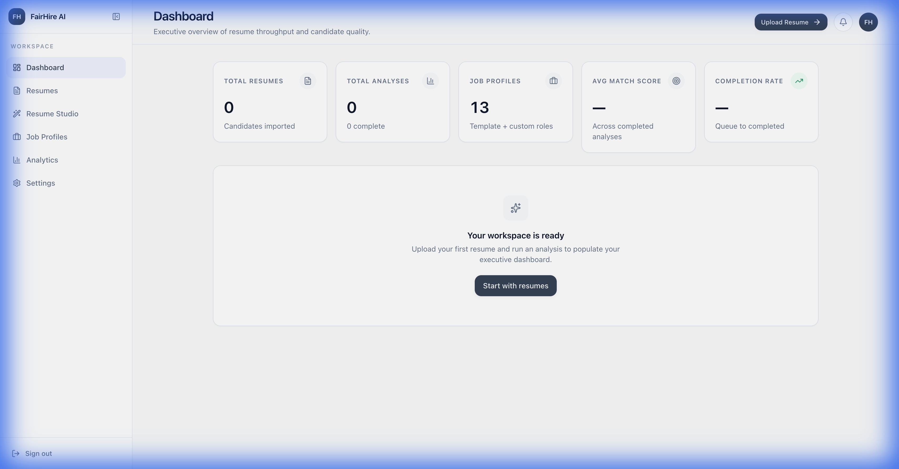
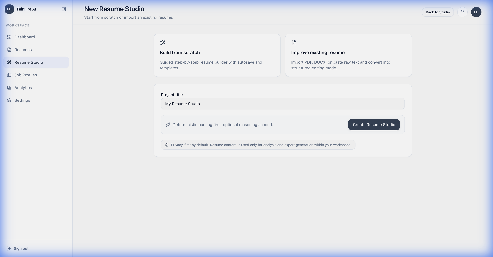
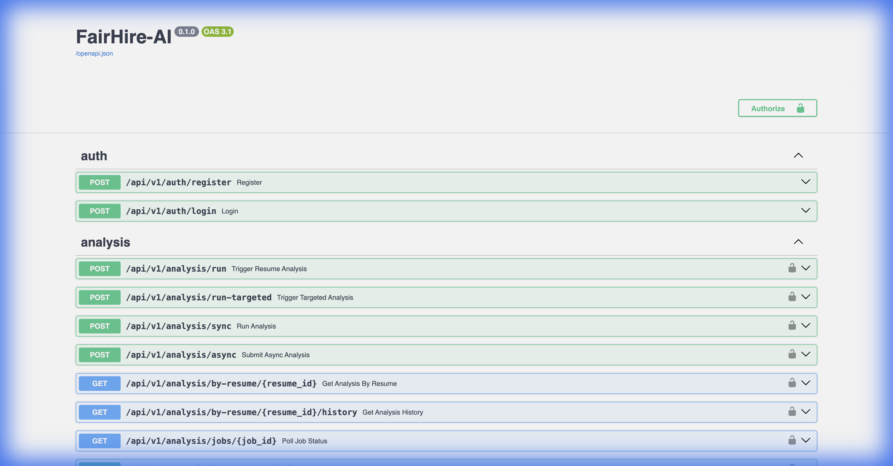
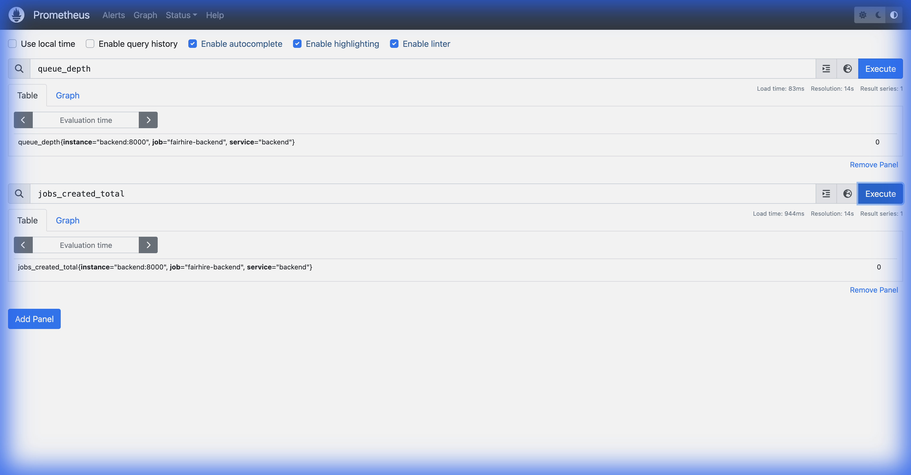
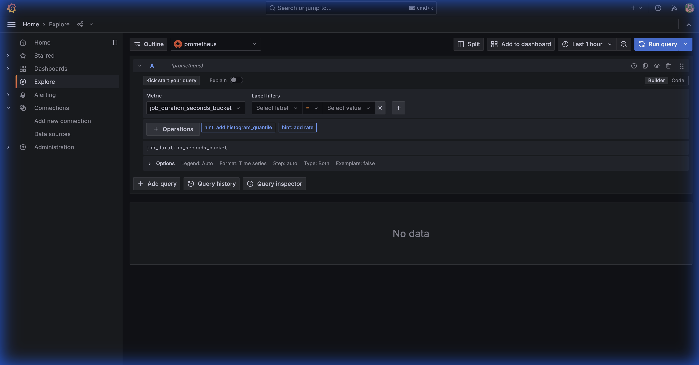

# FairHire-AI

AI-Powered Resume Intelligence Platform with Async LLM Runtime Safeguards. Built as a production-grade system demonstrating engineering rigor, scalability, and modern Python/TypeScript best practices.

## System Overview

```
┌────────────┐     ┌────────────┐     ┌────────────┐
│  Frontend   │────▶│  Backend   │────▶│ PostgreSQL │
│  Next.js    │     │  FastAPI   │     │            │
│  :3000      │     │  :8000     │     │  :5432     │
└────────────┘     └─────┬──────┘     └────────────┘
                         │
                    ┌────┴─────┐
                    │  Redis   │
                    │  :6379   │
                    └────┬─────┘
                         │
                   ┌─────┴──────┐
                   │  RQ Worker │
                   │  (async    │
                   │   analysis)│
                   └────────────┘

Observability:
  Prometheus  :9090   ──▶  Grafana  :3001
```

### Frontend Runtime

The Next.js 14 frontend provides a responsive, type-safe interface for managing projects and analyzing resumes.



### Resume Analysis Interface

Purpose-built studio for triggering async analysis jobs with real-time status feedback.



---

## Backend API Surface

The FastAPI backend exposes a fully documented REST API with Pydantic schemas and async database access.



---

## Async Runtime Observability

### Prometheus Metrics

Real-time instrumentation of queue depths, job throughput, and runtime safeguards.



**Key Metrics Tracked:**
- `queue_depth`: Current backlog of analysis jobs.
- `jobs_created_total`: Throughput of new analysis requests.
- `jobs_retried_total`: Transient failure tracking.

---

### Worker Utilization Monitoring

Grafana dashboards provide visibility into background worker performance and resource usage.



**Monitoring Capability:**
- Background job execution tracking
- TTL expiry monitoring
- Timeout enforcement
- LLM call budgeting metrics

---

## Async Inference-Oriented Runtime Design

The platform is designed to isolate inference-heavy resume analysis workloads from synchronous API request paths using a Redis-backed background worker runtime.

Current runtime design supports:

- Async job orchestration via RQ worker execution
- Decoupled API ingestion from analysis pipelines
- Containerized multi-service runtime using Docker Compose
- Healthcheck-driven service readiness validation
- Monitoring of background job throughput via Prometheus + Grafana

These execution paths enable long-running LLM-backed document analysis tasks to be processed asynchronously without degrading frontend request responsiveness.

---

## Deployment Runtime

> Containerized API + worker runtime deployed using Docker Compose to simulate a multi-service staging environment for async resume analysis workflows.

All services are defined in `docker-compose.yml` and orchestrated via a minimal `Makefile` interface.

### Quick Start

```bash
make dev
```

This launches the full stack:
- **Backend**: http://localhost:8000
- **Frontend**: http://localhost:3000
- **Prometheus**: http://localhost:9090
- **Grafana**: http://localhost:3001 (admin/admin)

Verify system health:

```bash
make health
```

---

## Project Structure

```
.
├── backend/
│   ├── app/
│   │   ├── api/             # Route handlers
│   │   ├── core/            # Config & Safeguards
│   │   ├── services/        # Business logic
│   │   └── workers/         # Async RQ worker handlers
│   ├── Dockerfile
│   └── requirements.txt
├── frontend/
│   ├── src/                 # Next.js pages
│   └── Dockerfile
├── infra/
│   └── prometheus.yml       # Metrics config
├── docs/
│   └── screenshots/         # Runtime captures
├── scripts/
│   └── healthcheck.py       # Stack verification
├── docker-compose.yml
└── Makefile
```
